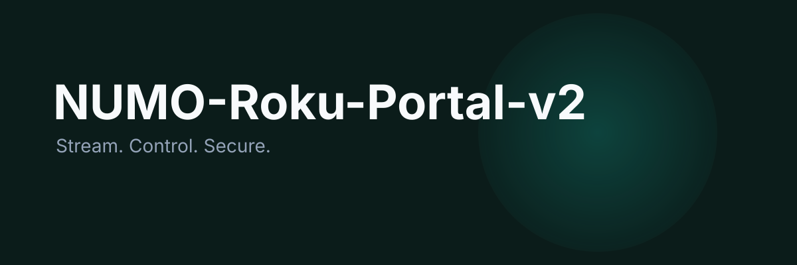
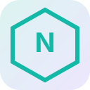

# NUMO-Roku-Portal-v2

<p align="center">
  
</p>

<p align="center">
  
</p>

<h3 align="center">Stream. Control. Secure.</h3>

<p align="center">Cross-platform Roku device management and semantic streaming suite.</p>

<p align="center">
  <a href="https://lumenhelixlab.github.io/NUMO-Roku-Portal-v2/">Launch Page</a>
  <span> · </span>
  <a href="https://github.com/lumenhelixlab/NUMO-Roku-Portal-v2">GitHub</a>
  <span> · </span>
  <a href="https://lumenhelix.com">LumenHelix</a>
</p>

---

NUMO-Roku-Portal-v2 is the cross-platform device management suite for Roku streaming. It combines a Tauri v2 desktop launcher, a Node.js BYOS semantic streaming server, a BrightScript Roku thin client, and a Kotlin Android remote — all communicating through RUBIC-encrypted 32.C.U.B.I.T. frames.

## Why NUMO-Roku-Portal-v2

- **Own the pipeline.** Host the streaming server locally with no required cloud intermediary.
- **Secure by design.** Capability-based Tauri permissions and RUBIC-224 command encryption.
- **Extend to any screen.** Add Roku channels, Android remotes, or new semantic adapters without rewriting the core.

## Quick start

### macOS / Linux

```bash
git clone https://github.com/lumenhelixlab/NUMO-Roku-Portal-v2.git
cd NUMO-Roku-Portal-v2
pnpm install
cd desktop && npm run dev
```

### Windows (PowerShell)

```powershell
git clone https://github.com/lumenhelixlab/NUMO-Roku-Portal-v2.git
Set-Location NUMO-Roku-Portal-v2
pnpm install
cd desktop
npm run dev
```

### Windows (Git Bash / WSL)

```bash
git clone https://github.com/lumenhelixlab/NUMO-Roku-Portal-v2.git
cd NUMO-Roku-Portal-v2
pnpm install
cd desktop && npm run dev
```

> Tested on Windows 11, macOS Sonoma, Ubuntu 22.04/24.04, and modern mobile browsers.

## Features

| Feature | What it gives you |
|---------|-------------------|
| Tauri desktop launcher | React + Tailwind onboarding, telemetry dashboard, sidecar management, and silent NSSM service deployment. |
| BYOS semantic server | Chrome DevTools Protocol capture, 64-D manifold mapping, RUBIC-encrypted CUBIT frames over WebSocket. |
| Roku thin client | BrightScript SceneGraph channel that receives encrypted frames and renders interactive overlays at 32 Hz. |
| Kotlin Android remote | SSDP discovery, ECP keypress commands, RUBIC reversible encryption, and graceful network degradation. |

## Architecture

```
desktop/  ->  Tauri v2 + React + Vite launcher
server/   ->  Node.js/TypeScript BYOS semantic engine
roku/     ->  BrightScript SceneGraph thin client
android/  ->  Kotlin SDK and mobile remote

All surfaces exchange RUBIC-encrypted 32.C.U.B.I.T. frames.
```

## Development

```bash
# Desktop Vite preview (no Rust required)
cd desktop
npm run dev

# Full Tauri desktop app
cd desktop
npm run tauri:dev

# BYOS server
cd server
npm run dev
```

## Roadmap

- [ ] Plug-and-play semantic adapter marketplace
- [ ] Headless installer and auto-update channel
- [ ] Cross-platform Android remote publishing pipeline

## License

Released under the MIT License.

---

<p align="center">
  <sub>NUMO-Roku-Portal-v2 is a <a href="https://lumenhelix.com">LumenHelix</a> project — Applied Symbolic Dynamics & Reversible Computation.</sub>
</p>
